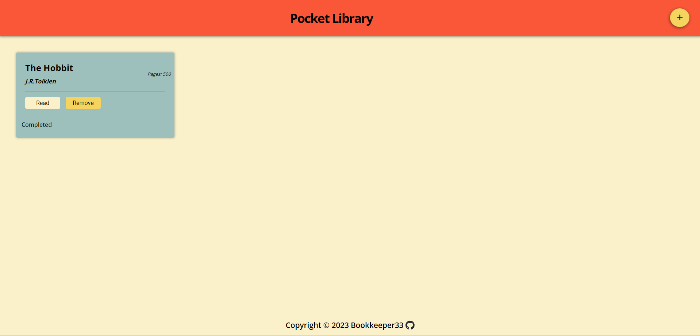

# Library App

## Description

Simple Library application to store your favorite books and track them.
This project is a part of The Odin Project (https://www.theodinproject.com/lessons/node-path-javascript-library) to practice Objects and Object Constructors.
(Refactored to ES6 Classes).

### Preview

Live preview: https://bookkeeper33.github.io/Library/

